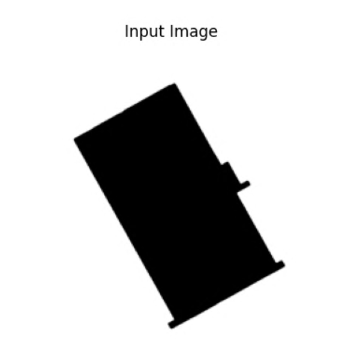
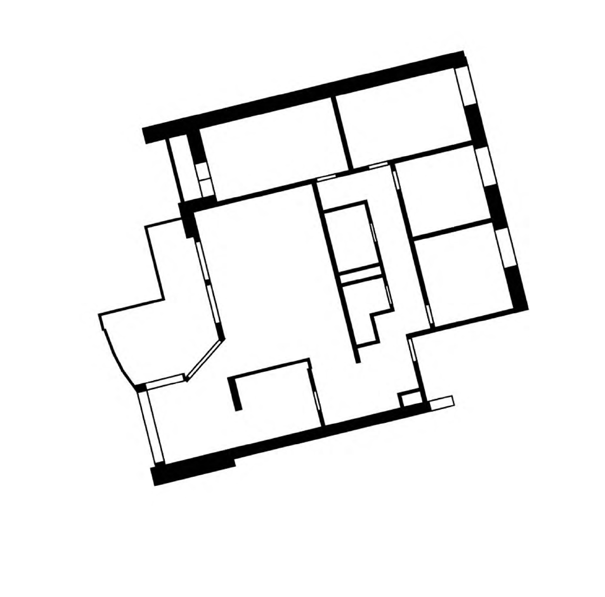

# VSSv1


<p align="center">
  
  
  
  
</p>

VSSv1 is the data and rendering stage of the 2024 project "Outline to Floorplan", exploring how machine learning can move beyond simply reproducing existing floorplan organization.

## Project: Outline to Floorplan (2024)

Project by Jan Bauer and Leo Graf. Supervisors: Benjamin Dillenburger and Anton Savov (Chair of Digital Building Technologies).

The Swiss Dwellings dataset provides a large base of residential plans and metadata (view, natural light, noise, and more). We use a pix2pix workflow where the generator translates one pixel constellation into another: footprint outlines in, floorplans out.

Research framing:

- Can spatial organization principles from unrelated fields inspire new architectural layouts?
- What happens when a generator is trained on hybrid structures that mix logics?

Key representation choices:

- All floorplans are recentered; a uniform square containing 95 percent of samples is used for training.
- A clean black and white graphic captures walls and openings without fixtures.
- A second representation assigns gray tones by room type to improve generator performance.

Snowflakes are used as an external reference because they show rich structural variety derived from simple rules. The hybrid dataset mixes snowflakes with floorplans to probe whether the generator can combine logics and produce new spatial behavior rather than replicas.

## What this repo does

- Recenter Swiss Dwellings geometries around the origin.
- Render floorplan PNGs from recentered geometries.
- Generate outline/xray variants of rendered floorplans.
- Provide notebooks and scripts for dataset preparation and splitting.
- Include pix2pix cGAN training notebooks (TensorFlow), derived from the original tutorial.

## Repo layout

```
.
├─ src/vssv1/              # Core pipeline modules
├─ notebooks/              # Jupyter notebooks for experiments
├─ scripts/                # Bash helpers (dataset splitting, renaming)
├─ tools/                  # Optional utilities
├─ assets/                 # Project imagery for docs
├─ data/                   # Expected dataset layout (ignored by git)
├─ outputs/                # Rendered images (ignored by git)
├─ requirements.txt
├─ requirements-tools.txt
└─ pyproject.toml
```

## Installation

1) Create and activate a virtual environment.

```
python -m venv .venv
source .venv/bin/activate
```

2) Install dependencies.

```
pip install -e .
```

If you prefer a plain requirements file:

```
pip install -r requirements.txt
```

Optional tools:

```
pip install -r requirements-tools.txt
```

## Data setup

Source data (Swiss Dwellings):

```
data/
  source/
    sdd/
      swiss-dwellings-v3.0.0/
        geometries.csv
```

Training data for pix2pix (side-by-side input|target PNGs):

```
data/
  splits/
    floorplans/
      train_FP_HD_512/
      test_FP_HD_512/
```

Set paths with environment variables if your data lives elsewhere:

```
export VSS_DATA_ROOT=/path/to/data
export VSS_TRAINING_ROOT=/path/to/training/splits
```

## Prepare data

Run the full preparation pipeline (recenter → render → bounds → xray/contour) with one command:

```
./scripts/prepare_data.sh
```

Defaults match the earlier manual steps:

- `GROUP_ID=floor_id`
- `START_ROW=0`
- `END_ROW=200`

You can override any of these:

```
GROUP_ID=floor_id START_ROW=0 END_ROW=200 ./scripts/prepare_data.sh
```

Disable optional steps if needed (useful for headless runs):

```
PLOT_SAMPLE=false OUTLINE=false RUN_BOUNDS=false RUN_XRAY=false ./scripts/prepare_data.sh
```

Rendered images are written to:

```
outputs/fp_png/fp_complete/
outputs/fp_png/fp_outline/
outputs/fp_png/fp_xray/
```

## Train (pix2pix cGAN)

Training lives in the pix2pix notebooks:

- `notebooks/storey_vss_512.ipynb` (primary, 512x512).
- `notebooks/storey_vss_256.ipynb` (legacy, 256x256).

Set `dataset_name` and `set_identifyer` in the notebook to match your training folders. Each PNG is a concatenated pair (input | target).
If you run locally, skip the Colab drive mount cell.

Optional inference helpers use:

- `VSS_INFERENCE_ROOT`: folder with input images for inference.
- `VSS_INFERENCE_OUTPUT`: output folder for generated videos.

## Configuration

Environment variables:

- `VSS_DATA_ROOT`: where source/processed data lives (default: `./data`).
- `VSS_OUTPUT_ROOT`: where output images are written (default: `./outputs`).
- `VSS_TRAINING_ROOT`: where pix2pix training splits live (default: `./data/splits`).
- `VSS_INFERENCE_ROOT`: optional input folder for pix2pix inference helpers.
- `VSS_INFERENCE_OUTPUT`: optional output folder for pix2pix videos.
- `VSS_REPO_ROOT`: override repo root if running from elsewhere.

## Notebooks

- `notebooks/storey_vss_512.ipynb`: pix2pix cGAN training at 512x512.
- `notebooks/storey_vss_256.ipynb`: pix2pix cGAN training at 256x256.
- `notebooks/01_dwellings_compiler.ipynb`: recentering + rendering pipeline.
- `notebooks/bigDatahandler.ipynb`: image post-processing and dataset splitting helpers.

Run notebooks from the repo root so `Path.cwd()` resolves correctly, or set the environment variables above.

## Notes

- `geopandas` may require system dependencies (GDAL/GEOS). If pip installation fails, consider using Conda.
- The dataset is large; expect multi-GB storage and long runtimes for full runs.

## License

MIT License. See `LICENSE`.

## Credits

- Snowflake photography: Wilson A. Bentley.


